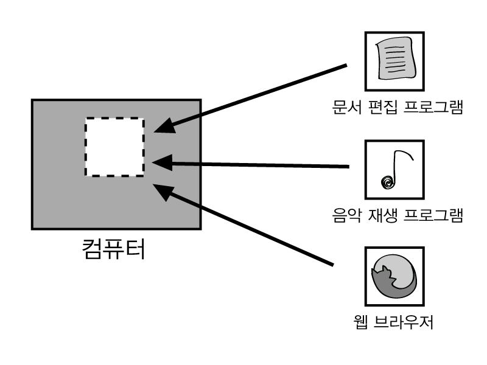
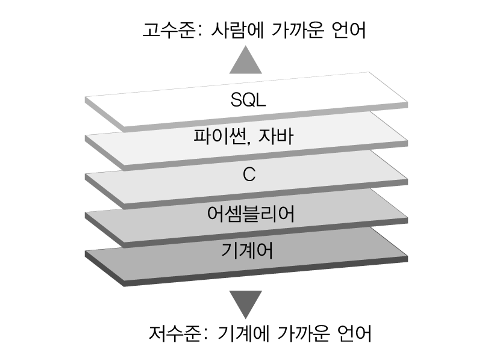
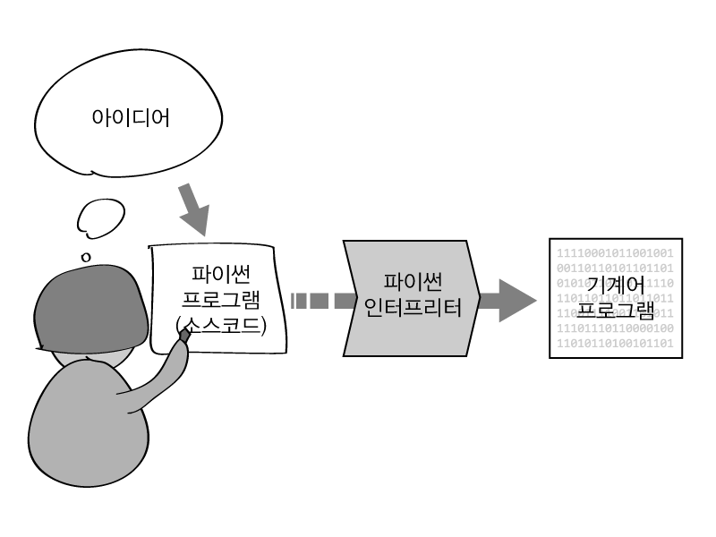

* table of contents
{:toc}

### 1.1.1 프로그램이란 무엇인가

프로그램은 어떤 일의 전체 내용에 대해 잘 모르는 사람도 그 과정을 차례차례 정확히 따라하기만 하면 작업을 수행할 수 있도록 안내하는 지식이다. 음식을 요리하는 방법을 기술한 조리법도 프로그램이다. 조리법을 정확하게 따르기만 하면, 요리를 잘 못하는 사람도 괜찮은 요리를 만들 수 있다.

컴퓨터 프로그램은 컴퓨터가 작업을 수행하는 과정을 담은 지식이다. 컴퓨터는 사람의 일에 대해 전혀 알 수 없고 관심도 없다. 하지만 컴퓨터 프로그램에 기술된 명령을 빠르고 정확하게 수행해내는 능력을 갖고 있다. 컴퓨터는 프로그램이 없으면 제대로 동작할 수 없지만, 반대로 좋은 프로그램이 많으면 다양한 일을 해낼 수 있다.

**그림 1-1** 컴퓨터는 프로그램이 있어야 다양한 일을 할 수 있다

컴퓨터 프로그램을 만드는 활동을 프로그래밍이라고 한다. 프로그래밍은 컴퓨터가 할 수 있는 일을 늘려나가고, 더 잘 할 수 있게 개선하는 활동이다. 당신은 앞으로 컴퓨터에게 일하는 방법을 가르쳐주는 방법을 배울 것이다.

### 1.1.2 프로그래밍 언어는 왜 필요한가

프로그램이 지식이라면, 그 지식은 언어로써 표현되어야 할 것이다. 프로그램을 작성하고 읽기 위해 만든 약속이 프로그래밍 언어다. 약속은 사람이 정한 것이므로, 원한다면 당신이 마음대로 정할 수도 있다. 하지만 지식을 잘 전달하려면 지식을 주는 쪽과 지식을 받는 쪽이 같은 약속을 따라야 한다.

컴퓨터에게 작업을 지시하기 위해서는 컴퓨터가 이해할 수 있는 언어, 즉 **기계어**로 명령해야 한다. 자연어 인식 기술이 많이 발전하고 있지만 컴퓨터는 여전히 사람의 언어를 제대로 이해하지 못한다. 컴퓨터가 사람의 말을 완전히 이해하기 전까지는 사람이 컴퓨터가 이해할 수 있는 언어로 프로그램을 작성할 수밖에 없다.

기계어는 컴퓨터의 가장 단순한 기본 명령 집합에 이진수로 일련번호를 부여해 둔 것이다. 컴퓨터는 낮은 전압(0)과 높은 전압(1)밖에 구별하지 못하고 단순한 작업을 정확하고 빠르게 반복할 수 있기 때문에 기계어가 딱 맞다. 기계어는 컴퓨터를 닮아 매우 단순하다. 하지만 너무나 단순한 나머지 역설적이게도 사람이 다루기에는 어렵다.

프로그램을 컴퓨터가 알아듣게 하려면 기계어로 작성해야 한다. 하지만 사람은 기계어를 쓰기가 어렵다. 그래서 컴퓨터 과학자들은 기계어를 사용하지 않고 프로그램을 쉽게 만들 수 있도록 기계어와 자연어 사이에 위치하는 다양한 프로그래밍 언어를 개발했다. 프로그래밍 언어는 사람이 비교적 쉽게 구사할 수 있고, 기계어로 번역될 수도 있다. 프로그래밍 언어는 컴퓨터와 사람 사이의 타협이자 공용어다. 이제 프로그래머는 기계어 대신 프로그래밍 언어로 프로그램을 작성할 수 있게 되었다. 기계어로 프로그래밍해야 했다면 프로그램은 만들기 어렵고 오류 투성이인 데다 비싸기까지 했을 것이다.

그림 1-2에 대표적인 몇 가지 언어가 나와 있다. 위쪽으로 갈수록 사람의 생각에 가까운 고수준 언어이고, 아래쪽으로 갈수록 컴퓨터의 기계적 특성에 가까운 저수준 언어다.

**그림 1-2** 고수준 언어와 저수준 언어

하지만 컴퓨터가 기계어만 이해할 수 있다는 사실은 바뀌지 않았다. 프로그래밍 언어로 작성한 프로그램은 기계어로 번역되어야 실행될 수 있다. 프로그래밍 언어는 기계어로 번역하기 위한 프로그램을 갖추고 있다. 이 번역 프로그램을 컴파일러(compiler) 또는 인터프리터(interpreter)라고 부른다.

**그림 1-3** 프로그램의 번역 과정

파이썬은 기계에 대해 잘 모르는 사람도 쉽게 배워 사용할 수 있는 고수준 프로그래밍 언어다. 파이썬으로 프로그램을 만든다는 것은 컴퓨터가 수행해야 할 작업을 파이썬 언어로 기술한다는 의미다. 우리는 파이썬으로 프로그램을 만들고, 만든 프로그램을 파이썬 인터프리터를 이용해 실행할 것이다.

### 1.1.3 파이썬 살펴보기

#### 파이썬은 누가 만들었나

파이썬은 귀도 반 로섬(Guido van Rossum)이라는 프로그래머가 1989년에 처음 만들었다. 그 뒤 여러 사람들이 파이썬의 발전에 기여해 현재 버전 3까지 발표되었다. 파이썬의 언어 체계는 파이썬 소프트웨어 재단(Python Software Foundation, PSF)이 관리하고 있고, 비공식적으로도 수많은 프로그래머가 파이썬에서 활용할 수 있는 다양한 모듈을 개발해 파이썬 생태계에 기여하고 있다.

**그림 1-4** 파이썬 로고

파이썬은 무료다. 파이썬 프로그램을 실행시키는 인터프리터는 파이썬 공식 웹사이트(<https://www.python.org/>)에서 무료로 다운로드하여 자유롭게 사용할 수 있다. 파이썬을 다운로드하고 설치하는 방법은 다음 절에서 안내한다.

#### 파이썬의 특징

세상에는 다양한 프로그래밍 언어가 있고 언어마다 특징이 다르다. 파이썬과 다른 고수준 프로그래밍 언어를 비교해 보자.

언어            | 패러다임            | 데이터 유형 | 메모리 관리
--------------- | ------------------- | ----------- | -----------
C               | 절차적 프로그래밍   | 정적        | 수동
C++             | 다중 패러다임       | 정적        | 수동
자바(Java)      | 객체지향 프로그래밍 | 정적        | 자동
루비(Ruby)      | 객체지향 프로그래밍 | 동적        | 자동
클로저(Clojure) | 함수형 프로그래밍   | 동적        | 자동
하스켈(Haskell) | 함수형 프로그래밍   | 정적        | 자동
파이썬          | 다중 패러다임       | 동적        | 자동

**표 1-1** 고수준 프로그래밍 언어 비교

**패러다임**: 프로그래밍 패러다임은 프로그램을 잘 작성하기 위한 방법과 지침이다. 파이썬은 특정 프로그래밍 방식을 강제하지 않고 다양한 방식을 골고루 지원하는 다중 패러다임 언어다.

**데이터 유형**: 프로그래밍 언어는 변수의 데이터 유형을 미리 정하는 정적 방식과 변수의 데이터 유형이 자유로운 동적 방식으로 나눌 수 있다. 파이썬은 사용하기 간편한 동적 방식을 채택했다.

**메모리 관리**: 메모리는 데이터를 기억하는 공간으로, 모든 프로그램이 나누어 사용하는 중요한 자원이다. 파이썬은 메모리를 자동으로 관리해주기 때문에 프로그래머가 메모리와 관련된 문제로 골치를 썩을 일이 별로 없다.

패러다임, 데이터 유형, 메모리라는 말이 생소하고 잘 이해되지 않아도 괜찮다. 파이썬이 다양한 프로그래밍 방식을 지원하고, 데이터를 다루는 것이 간편하며, 메모리 관리를 할 필요가 없어 사용하기 쉽다고만 생각하면 된다.

#### 파이썬이 인기 있는 분야

파이썬은 다양한 분야에 사용될 수 있을 만큼 강력하고, 실제로도 활용되고 있다.

* 프로그래밍 교육: 배우기 쉬운 언어인 파이썬은 프로그래밍 입문용 언어로 사랑받고 있다.

* 웹 서비스: 웹 서비스란 웹 사이트, 인터넷 쇼핑몰, 블로그, 채팅 등 웹 브라우저로 인터넷에 접속한 사람들에게 제공하는 다양한 서비스다. 파이썬은 여러 웹 서비스의 개발과 운영에 활용되고 있다. 특히 장고 웹 프레임워크(Django Web Framework)라는 파이썬 기반의 프레임워크를 활용하면 전문적인 웹 서비스를 빠르고 짜임새 있게 만들 수 있다.

* 데이터 과학: 통계와 시각화 도구를 활용해 복잡하고 큰 데이터 속에서 의미 있는 지식과 통찰을 이끌어내는 기술을 데이터 과학이라고 부른다. 많은 데이터 과학자들이 파이썬을 활용하고 있다. 파이썬은 다양한 데이터 구조를 기본으로 지원하며, 넘파이(NumPy), 사이파이(SciPy), 맷플롯(matplotlib) 라이브러리를 이용해 다양한 수치 연산 알고리즘을 활용하고 차트를 그릴 수 있다.

* 기계학습: 기계학습(machine learning)은 알파고, 이미지 인식, 자율주행 등 인공지능 관련 기술의 핵심이다. 파이썬은 기계학습에도 널리 사용되고 있다. 사이킷런(scikit-learn) 라이브러리가 다양한 기계학습 알고리즘을 제공하며, 구글(Google)의 고성능 기계학습 도구인 텐서플로(TensorFlow)도 파이썬 코드로 프로그래밍하도록 되어 있다.

* 명령행 유틸리티: 파이썬은 맥, 리눅스(Linux) 같은 유닉스(Unix) 계열의 운영체제에서 간단한 유틸리티를 작성하는데 많이 사용된다. 파이썬 인터프리터는 많은 리눅스 배포판에 기본으로 포함되어 있다.

#### 다른 언어가 필요한 분야

특정한 언어를 사용해야만 하는 분야도 있다. 프로그래밍 지식은 여러 언어에서 통용되므로 파이썬을 먼저 배운 뒤에 이들을 배우는 것도 좋다.

* 프론트엔드 웹 개발: 프론트엔드 웹 기술은 웹 브라우저를 조작하는 기술로 웹 문서를 표현하거나 웹 애플리케이션을 만들 때 사용된다. 이 분야에는 하이퍼텍스트 마크업 언어(HTML), 캐스케이딩 스타일 시트(CSS), 자바스크립트(Javascript)라는 언어가 주로 사용된다.

* 모바일 애플리케이션: 안드로이드 애플리케이션 개발에는 자바, iOS 애플리케이션 개발에는 오브젝티브-C(Objective-C)가 사용된다.

* 게임, 그래픽: 파이썬으로도 파이게임(Pygame) 라이브러리를 이용해 간단한 2D 그래픽 게임을 만들 수 있다. 하지만 최신 고사양 그래픽의 탑재한 게임을 만들 때는 주로 C, C++, C# 등이 사용된다.

