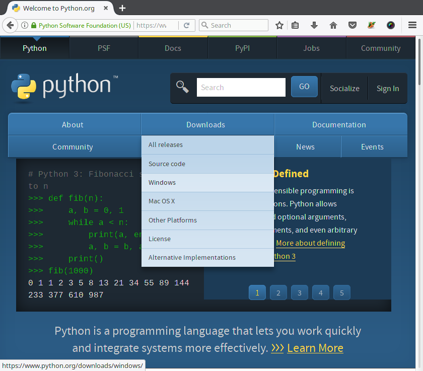
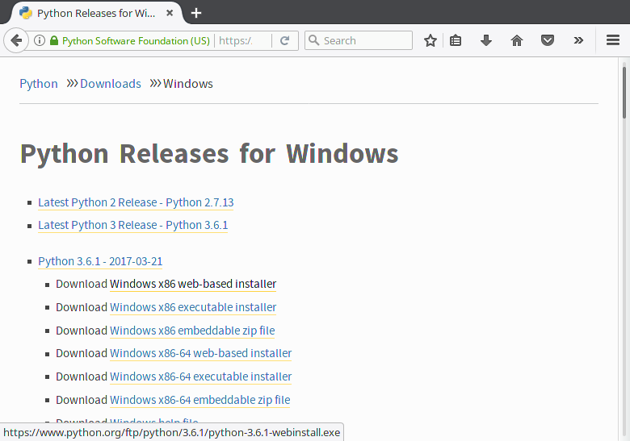
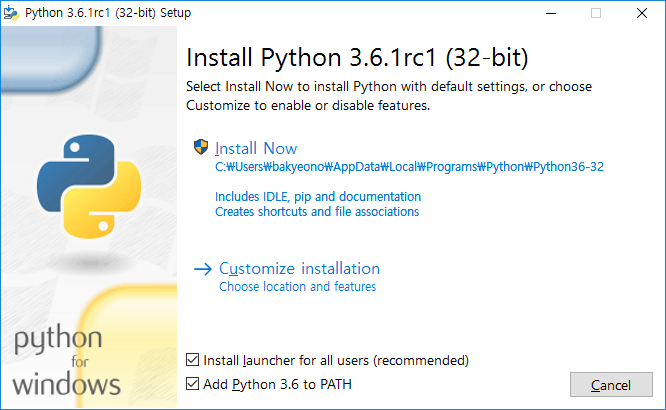
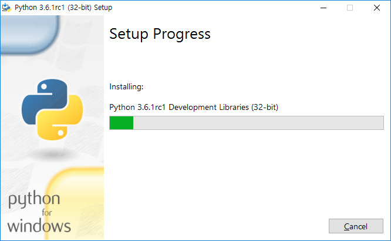
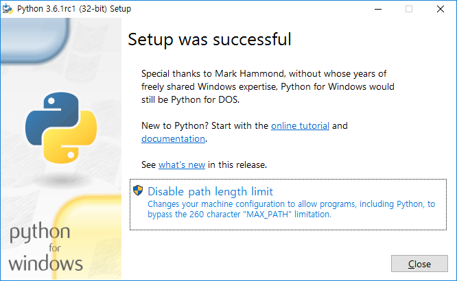

* table of contents
{:toc}

컴퓨터 프로그램을 만들기 위해서는 프로그램을 작성하기 위한 환경과 프로그램을 실행하고 테스트하기 위한 환경이 필요하다. 이들을 합쳐서 프로그래밍 환경이라고 한다.

### 1.2.1 하드웨어 환경

프로그래밍 환경은 하드웨어 환경과 소프트웨어 환경 둘 다를 의미한다. 특수한 분야의 프로그래밍에는 특수한 하드웨어가 필요한 경우도 있다. 하지만 일반적인 프로그래밍 학습에는 일반적인 컴퓨터만 있으면 충분하다.

어쨌든 중요한 것은 컴퓨터를 준비해야 한다는 것이다. 마음대로 사용할 수 있는 개인용 컴퓨터가 있어야 수시로 실습을 진행할 수 있다. 컴퓨터의 사양이 높을 필요는 없다. 가벼운 마음으로 언제든지 마음대로 쓸 수 있는 컴퓨터면 된다.

컴퓨터가 많이 보급되었지만 여전히 자신만의 컴퓨터를 소유하지 못한 독자도 있을 것이다. 비용 때문에 컴퓨터를 마련하지 못한 경우리면 30만 원 가량에 구입할 수 있는 저사양 노트북이나 5만원 정도에 구입할 수 있는 라즈베리 파이 등을 알아보는 것도 좋다. 중고 시장에서도 잘 찾아보면 쓸만한 노트북을 저렴하게 살 수 있다.

정말로 컴퓨터를 준비할 방법이 없다면 도서관, 학교, 관공서 등의 공공시설에서 컴퓨터를 사용하는 방법이라도 사용해라. 하지만 복무중인 군인이나 교도소에 복역중인 수감자처럼 신체의 자유가 없는 독자는 실습을 진행할 방법이 없다. 책을 최대한 꼼꼼이 읽는 수밖에 없다.

스마트폰도 컴퓨터이므로 프로그래밍에 이용할 수 있다. 그러나 스마트폰은 입력장치가 너무 불편하다. 입력해야 할 코드의 양이 많으므로 프로그래밍을 학습할 때는 물리적인 키보드가 있는 환경을 권장한다.

### 1.2.2 소프트웨어 환경

프로그래밍을 위한 소프트웨어 환경으로는 크게 운영체제, 텍스트 편집기, 컴파일러와 인터프리터를 꼽을 수 있다.

#### 운영체제

운영체제는 하드웨어를 직접 제어하는 프로그램이다. 파이썬과 같은 고수준 프로그래밍 언어는 하드웨어를 직접 제어하지 않고 운영체제가 제공하는 서비스를 통해 간접적으로 하드웨어를 활용한다.

특정 운영체제에서만 사용할 수 있는 프로그래밍 언어도 있다. 하지만 파이썬은 대부분의 운영체제를 지원한다. 그렇다면 어떤 운영체제를 선택해야 할까?

* 윈도우(Windows): 윈도우는 마이크로소프트가 생산·판매하는 운영체제다. 컴퓨터를 잘 모르는 사람이 사용하기 쉬워서 많은 사람들이 사용한다. 아마 당신도 사용하고 있을 가능성이 높다. 하지만 프로그래밍 환경을 구성할 때는 유닉스(Unix) 계열의 운영체제보다 조금 불편한 점이 있다.

* 리눅스(Linux): 리눅스는 널리 사용되는 유닉스 계열 운영체제다. 돈 주고 사야하는 윈도우와는 달리 소스코드가 공개되어 있고 누구나 자유롭게 사용할 수 있다. 초보자가 사용하기에는 어렵지만 다양한 시스템 유틸리티와 명령행 스크립트 등을 지원해 프로그래밍 환경을 갖출 때는 편리하다. 프로그래밍의 길을 걷는다면 언젠가 학습해서 사용해보기 바란다.

* 맥OS(macOS): 맥OS는 애플이 생산·판매하는 컴퓨터에 탑재되는 운영체제다. 이것도 유닉스 계열의 운영체제여서 프로그래밍 환경을 갖추기에 유리하다. 리눅스에 적응하기가 힘든 사람이 쓰기에 좋지만, 특정한 컴퓨터에서만 사용할 수 있고 가격이 비싸다는 단점이 있다. 

운영체제는 서로 장단점이 있으니 선택은 자유다. 당신이 익숙하고 가장 편하게 쓸 수 있는 것을 쓰면 된다. 대부분의 독자에게는 윈도우일 것이다. 이 책은 윈도우와 리눅스에서 파이썬 실습 환경을 갖추는 방법을 설명한다. 그 외의 운영체제를 사용한다면 스스로 파이썬을 설치하고 실행해야 한다는 점만 빼면 책의 다른 내용을 학습하는데는 문제가 없을 것이다.

#### 텍스트 편집기

파이썬을 포함한 거의 모든 프로그래밍 언어에서는 텍스트 파일로 프로그램을 작성한다. 

텍스트 파일은 순수한 텍스트로만 이루어진 문서다. 용지 설정, 서식(글꼴, 색상 등), 표 등을 포함하는 워드 문서와는 다르다. 윈도우에서 텍스트 파일을 만드는 대표적인 방법은 메모장 프로그램을 이용하는 것이다.

프로그래밍을 하려면 텍스트 파일을 편집하는 프로그램이 필요하다. 프로그래밍용 텍스트 편집기는 행 번호를 표시하는 기능, 함수를 찾아주는 기능, 문법을 강조해주는 기능 등 프로그램에 도움이 되는 부가 여러 부가 기능을 제공한다. 반면에 윈도우 메모장은 대표적인 텍스트 편집기지만 기능이 너무 단순하고 성능이 떨어져서 프로그래밍에는 잘 사용되지 않는다. 

프로그래밍용 텍스트 편집기는 매우 다양하고, 그 중 빔(Vim), 아톰(Atom), 서브라임 텍스트(Sublime Text)가 많은 기능을 갖추고 있어 인기가 많다. 이런 고급 편집기는 다양한 기능을 제공하는만큼 따로 시간을 내서 사용법을 익혀야 제대로 쓸 수 있다. 이 책은 입문자를 배려하기 위해 이런 고급 편집기 대신 파이썬과 함께 설치되는 IDLE('아이들'이라고 읽는다)을 이용해 실습을 진행한다.

#### 컴파일러와 인터프리터

프로그래밍 언어로 만든 프로그램을 실행하려면 컴파일러 또는 인터프리터를 이용해 기계어로 번역해야 한다. 파이썬 실습을 하려면 파이썬 인터프리터를 설치해야 한다. 파이썬 인터프리터도 다양한 종류가 있지만 이 책은 공식 파이썬 인터프리터인 CPython 을 이용한다.

#### 그 외의 도구

이 외에도 프로그래밍을 도와주는 소프트웨어가 많다. 버전 관리 프로그램, 테스트 자동화 프로그램, 배포 자동화 프로그램, 문서 작성 프로그램, 디버그 프로그램, 라이브러리 의존성 관리 프로그램 등 다양한 프로그램이 프로그래밍 실무 작업에 사용된다. 하지만 지금은 이런 것들에 대해 잘 몰라도 괜찮다.

#### 통합 개발 환경

다양한 도구를 따로따로 사용해도 되지만, 여러 기능을 하나로 모아 쓰기 쉽게 제공하는 통합 프로그램도 있다. 이것을 통합 개발 환경(Integrated Development Environment)이라고 부른다. 파이썬을 지원하는 통합 개발 환경으로는 파이참(Pycharm)과 우리가 실습에 활용할 IDLE이 대표적이다.

### 1.2.3 윈도우 환경에 파이썬 설치하기

프로그래밍 환경에 대해 알아 보았으니, 이제 프로그래밍 환경을 실제로 갖춰 볼 차례다. 아래의 내용을 따라 당신의 컴퓨터에 파이썬을 설치하자.

#### 파이썬 다운로드

먼저 웹 브라우저를 실행해 파이썬 공식 웹사이트에 접속한다. 검색 엔진에 'Python'을 검색해 접속하거나 주소(<http://python.org/>)를 직접 타이핑해서 접속해도 된다.

**그림 1-5** 파이썬 웹사이트

파이썬 웹사이트에 접속하면 영문으로 된 페이지가 나온다. 영어를 잘 모르면 어려움이 있겠지만, 다운로드(Downloads)라는 단어는 충분히 찾을 수 있을 것이다. Downloads > Windows를 찾아 클릭한다.

**그림 1-6** 윈도우용 파이썬 다운로드 페이지

다운로드 페이지에는 파이썬의 버전 목록과 버전별 패키지 목록이 나온다. 여러 개여서 선택하기 어려울 수 있지만 맨 위의 것을 다운로드하면 된다. 이 책에서는 'Python 3.6.1'의 'Download x86 web-based installer'를 클릭해 다운로드하고 있다. 당신이 이 책을 볼 때는 새로운 버전이 나왔을 수도 있다. 이 책과 다르더라도 가장 위에 있는 최신 버전의 'Windows x86 web-based installer'를 클릭해 다운로드하면 된다.

> **참고**
> 
> 이 책은 파이썬 3.6이 최신 버전인 시점을 기준으로 하고 있지만 책을 읽고 있는 시점에는 더 높은 버전이 나왔을 가능성이 높다. 버전의 앞자리 숫자가 3이기만 하면 뒤의 숫자는 차이가 나도 큰 문제는 없다. 그리고 바로 위에서 x86 빌드를 다운로드하라고 안내했는데 당신이 64비트 컴퓨터를 사용하고 있다면 x86-64 빌드를 다운로드해 설치해도 된다. 이게 무슨 말인지 모르겠으면 무시해도 된다.

#### 설치

다운로드를 마쳤으면 설치 프로그램을 실행해 설치를 진행한다. 버전에 따라 설치 프로그램의 모양이 책과는 다를 수도 있다. 설치 화면에서 **바로 설치 버튼을 누르지 말고** 잠깐 화면을 살펴보자.

**그림 1-7** 윈도우용 파이썬 설치 프로그램

설치 화면의 아래쪽을 보면 **'ADD Python to PATH'**이 있다. 이것을 를 꼭 체크해 두도록 하자. 파이썬을 컴퓨터 내 어느 경로에서든 실행할 수 있게 해준다. 이걸 체크하지 않으면 직접 PATH 환경변수를 설정해야 한다. 체크한 뒤 화면 가운데의 'Install Now'를 클릭하면 설치가 자동으로 진행된다.

> **참고**
> 
> 파이썬을 설치할 때 실수로 ADD Python to PATH를 체크하지 않은 독자는 설치를 마친 뒤에 이 방법으로 PATH를 설정하면 된다.
> 
> 1. 시작 버튼(윈도우 로고 버튼)을 마우스 오른쪽 버튼으로 클릭 -> '시스템' -> '고급 시스템 설정' -> '고급 탭' -> '환경 변수'를 차례로 클릭
> 2. PATH를 찾아 더블클릭
> 3. 환경 변수 편집 창에서 '새로 만들기' 버튼을 클릭하고 파이썬을 설치한 경로를 입력
> 
> 파이썬이 설치되는 기본 경로는 '드라이브문자:\Users\사용자명\AppData\Local\Programs\Python\파이썬버전\' 이다. 예를 들어 사용자명이 bakyeono이고 설치한 파이썬 버전이 3.6인 경우는 다음의 두 경로를 추가하면 된다.
> 
> * C:\Users\bakyeono\AppData\Local\Programs\Python\Python36-32\
> * C:\Users\bakyeono\AppData\Local\Programs\Python\Python36-32\Scripts
> 
> 초보자가 하기는 어려울 수 있기 때문에 꼭 'ADD Python to PATH'를 체크하고 설치하자. 너무 어렵다고 느껴지만 파이썬을 삭제하고 다시 설치하는 것도 방법이다.

**그림 1-8** 윈도우용 파이썬 설치 진행중

파이썬 패키지에는 파이썬 인터프리터 외에도 여러 라이브러리와 보조 도구가 포함되어 있어서 모두 설치하려면 몇 분 정도 시간이 걸린다. 설치가 완료될 때 까지 잠시 기다려주자.

**그림 1-9** 윈도우용 파이썬 설치 완료

위의 화면이 나오면 설치가 완료된 것이다. 'Close' 버튼을 눌러 설치 프로그램을 종료하자.

설치를 마쳤다면 **1.3 첫 파이썬 프로그램**을 학습하러 가자.

### 1.2.4 리눅스 환경에 파이썬 설치하기

윈도우 사용자는 이 절을 건너뛰면 된다.

대다수 리눅스 배포판에는 파이썬이 기본으로 포함되어 있다. 당신의 시스템에도 파이썬이 이미 설치되어 있을 가능성이 높다. 하지만 파이썬 버전이 3이 아니라 2인 경우가 많고, 이 책의 실습에 사용하는 IDLE이 같이 설치되어 있지 않은 경우도 많다. 그러므로 이 책의 학습을 위해서는 시스템에 파이썬이 설치되어 있더라도 추가로 파이썬 3과 IDLE을 설치해야 한다. 그런데 파이썬 3용 IDLE을 설치하면 파이썬3이 같이 설치되므로, 실제로는 IDLE만 설치하면 된다.

리눅스 배포판에는 프로그램을 다운로드하고 설치하고 관리해주는 '패키지 관리 프로그램'이 포함되어 있다. 패키지 관리 프로그램을 이용하면 파이썬이 자동으로 다운로드 되므로 파이썬 공식 웹사이트에서 직접 파이썬을 다운로드할 필요가 없다. 리눅스 배포판은 여러 가지가 있으므로 아래 설명에서 당신의 시스템에 맞는 것을 따라 IDLE을 설치하자.

#### 데비안 계열 배포판에서 설치

우분투, 데비안, 라즈비안(라즈베리 파이의 OS) 등의 데비안 계열 배포판에서는 'idle3' 패키지를 설치하면 된다. 명령행 인터페이스(터미널 에뮬레이터)를 사용하는 환경이라면 아래의 명령을 입력한다. (각 행의 앞에 나오는 달러 기호(``$ ``)는 프롬프트를 나타내는 기호다. 따라 입력하지 않는다.)

    $ sudo apt-get update
    $ sudo apt-get install idle3

#### 아크 리눅스 계열 배포판에서 설치

아크 리눅스, 만자로 리눅스 등의 아크 리눅스 기반 배포판에서는 pacman을 이용해 프로그램을 설치한다. 명령행 인터페이스에 아래의 명령을 입력하면 IDLE과 파이썬이 실치될 것이다.

    $ sudo pacman -Syu
    $ sudo pacman -S idle tk --needed

데비안과는 다르게, IDLE의 패키지명이 'idle3'이 아니라 'idle'이라는 점과, 'tk' 패키지를 함께 설치해야 하는 점에 유의하자.

