* table of contents
{:toc}

프로그래밍 환경을 준비하느라 고생 많았다. 이제 첫 파이썬 프로그램을 만들어 보자. 이 내용은 컴퓨터에 덜 익숙할 가능성이 높은 윈도우 사용자를 배려해 작성되었다. 화면은 조금 다르겠지만 리눅스에서 실습하는 방법도 크게 다르지 않다.

### 1.3.1 파이썬 프로그램 작성하기

#### 실습 디렉토리 만들기

먼저 우리가 앞으로 실습하며 만드는 파이썬 프로그램을 모아 둘 디렉토리를 하나 만들어 두자. 어디든 괜찮지만 실습의 편의를 위해 이 경로를 추천한다.

* 윈도우 환경: C:\python-programming
* 리눅스 환경: ~/python-programming

이 책의 내용은 이 위치를 기준으로 설명이 진행된다. 다른 위치로 디렉토리를 만들었다면 스스로 위치를 수정해 실습을 진행하자.

#### IDLE 실행하기

이 책은 파이썬 실습을 위해 IDLE을 사용한다. IDLE은 파이썬 프로그램을 만들고 실행할 때 사용하는 파이썬의 통합 개발 환경 프로그램이다. 메모장 같은 텍스트 편집 프로그램과 비슷하지만, 파이썬에 특화되어 있다.

**1.2 프로그래밍 환경**의 내용을 따라 파이썬을 설치했다면 IDLE이 파이썬과 함께 설치되어 있을 것이다. 그러니 따로 IDLE을 설치할 필요는 없다.

윈도우에서 IDLE을 실행하려면 시작 버튼(윈도우 로고 버튼)을 누르고 Python -> IDLE을 누른다. 그림 1-10을 참고하자.  

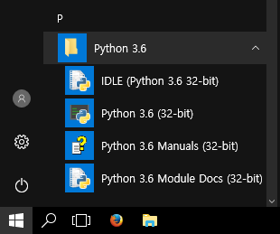

**그림 1-10** IDLE 실행하기

파이썬이 잘 설치되었다면 그림 1-11과 같은 프로그램이 실행될 것이다. 이것이 IDLE이다.

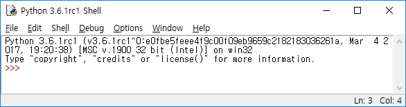

**그림 1-11** IDLE 실행 화면

> **참고** IDLE을 사용하지 않고 파이썬 프로그래밍 하기
> 
> IDLE을 이용하면 텍스트 편집과 프로그램 실행을 간편하게 할 수 있어 초보자가 프로그래밍을 배울 때 편리하다. 하지만 파이썬 프로그래밍을 하기 위해 반드시 IDLE을 사용해야하는 것은 아니다.
> 
> 파이썬 프로그램 파일은 단순한 텍스트 파일일 뿐이다. 그러므로 메모장 등 여러 가지 텍스트 편집기를 이용해 파이썬 프로그램을 작성할 수 있다. 파이썬 프로그램을 실행할 때는 명령행 인터페이스(명령 프롬프트, 터미널 에뮬레이터 등)에서 파이썬 인터프리터를 직접 실행하면 된다.
> 
> 그러나 지금은 이런 것까지는 몰라도 된다. 언젠가 운영체제 명령행 인터페이스의 사용법을 배울 때 자연히 알게 될 것이다.

#### IDLE로 프로그램 작성하기

IDLE의 기본 사용법은 다른 파일 편집 프로그램과 크게 다르지 않다. 새 파일을 만들어 저장할 수 있고, 저장한 파일을 불러와 다시 편집할 수도 있다.

파이썬 프로그램 파일을 새로 만들어 보자.

IDLE을 실행한 후, 상단의 메뉴에서 File -> New File 을 클릭한다.

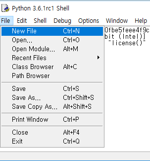

**그림 1-12** IDLE 새 파일 만들기

그러면 파일을 편집하는 창이 나타난다. 이제 화면에 표시된 창은 두 개다. 두 창을 그림 1-13 처럼 좌우로 나란히 배치해 두자. 파이썬 프로그래밍을 할 때 두 창을 번갈아가며 동시에 사용하는 경우가 많기 때문에 두 창을 함께 볼 수 있으면 편리하다. 꼭 이렇게 배치할 필요는 없으며 다른 방식이 편하다면 편한 방식으로 배치해 두어도 된다. 단, 책의 설명을 볼 때 두 창을 잘 구분하도록 하자.

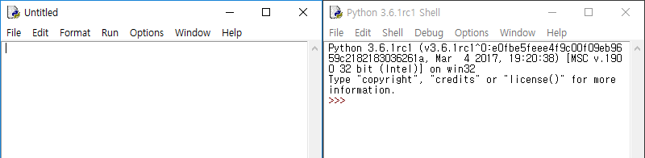

**그림 1-13** IDLE 창 배치

그림 1-13에서 왼쪽에 배치한 창은 **파일 편집 창**이다. 이 창에서 파이썬 프로그램을 작성하고 파일로 저장한다. 아직 파일을 저장하지 않았으므로 창의 제목이 '제목 없음'을 뜻하는 'Untitled'로 되어 있다. 그리고 창 안에는 아직 아무 내용도 없다. 

오른쪽에 배치한 창은 **대화식 쉘 창**이다. 제목이 Python 3.6.1rc1 Shell 이고, 창 안에는 영문으로 파이썬 버전에 관한 메시지와 ``>>>``라는 기호가 출력되어 있다. 지금은 이 메시지와 기호를 신경쓰지 말자. 왼쪽 창에서 프로그램을 만들어 실행하면 이 오른쪽 창에 실행 결과가 출력된다.

파일 편집 창에 코드 1-1의 내용을 따라 입력해 보자. 코드 내용에 대해서는 잠시 후 설명할 것이니 무슨 뜻인지 모른다고 걱정하지 않아도 된다. 지금은 오타 없이 똑같이 따라 입력하는 데만 집중하자.

# 첫 파이썬 프로그램

    print('당신의 이름은 무엇인가요?')
    name = input()
    print(name, '님 반가워요.')

**코드 1-1** 첫 파이썬 프로그램

> **주의**
> 
> 코드를 입력할 때는 완전히 똑같이 입력하는 것이 중요하다. 띄어쓰기, 기호 하나라도 틀리면 오류가 발생할 수 있다. 대문자와 소문자도 구별해야 한다. 오타가 나면 지우고 다시 작성하자.

코드를 다 입력하면 그림 1-14처럼 될 것이다. 코드를 정확하게 입력했는지 잘 확인해 보자.

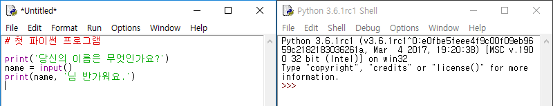

**그림 1-14** IDLE에 코드 입력을 마친 화면

이제 입력한 코드를 파일로 저장하자. 파일 편집 창의 상단 메뉴에서 File -> Save As... 를 클릭한다.

**그림 1-15** 파이썬 프로그램 저장하기 1

파일을 저장할 위치를 아까 만들어 둔 디렉토리(C:\python-programming)로 지정하고, 파일명은 first-program.py로 하여 저장하자. 파일의 확장자(파일 이름의 마침표 뒤에 붙는 글자)를 py로 하는 것에 주의하자. py 확장자는 이 파일이 파이썬 프로그램 소스코드라는 것을 나타낸다.

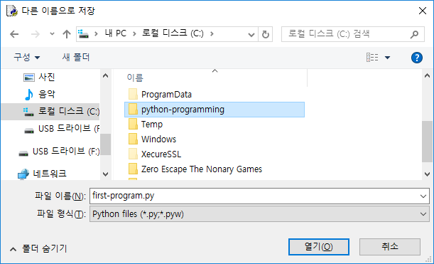

**그림 1-16** 파이썬 프로그램 저장하기 2

파일이 저장되었으므로 파일 편집 창 상단의 제목이 제목 없음을 뜻하는 'Untitled'에서 파일 이름(first-program.py)으로 변했다.

### 1.3.2 파이썬 프로그램 실행하기

방금 만든 첫 파이썬 프로그램을 실행해 보자.

#### IDLE로 프로그램 실행하기

파일을 작성한 창의 상단 메뉴에서 Run -> Run Module 을 클릭하면 프로그램을 실행할 수 있다.

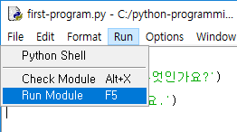

**그림 1-17** 파이썬 프로그램 실행하기

프로그램을 실행하면 오른쪽에 배치해 둔 대화식 쉘 창에 ``당신의 이름은 무엇인가요?``라는 텍스트가 출력된다. 이 창에 원하는 내용을 아무 것이나 입력해 대답해 보자. 예제에서는 ``박연오``라고 입력했지만, 당신의 이름을 입력해봐도 좋다. 입력 후 엔터 키를 누르면 ``박연오 님 반가워요.``라는 텍스트가 출력될 것이다. 그림 1-18 처럼 출력되면 성공이다.

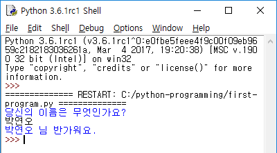

**그림 1-18** 프로그램 실행 결과

#### 오류가 발생했을 때

프로그램을 잘못 입력했다면 오류가 발생할 수 있다. 오류에 대처하는 방법을 알아보자.

초보자가 가장 발생시키기 쉬운 오류는 문법 오류다. 문법 오류는 당신이 입력한 코드가 파이썬 문법에 맞지 않아 해석할 수 없기 때문에 발생한다. 코드에 문법 오류가 있으면 그림 1-19와 같은 경고창이 출력된다.

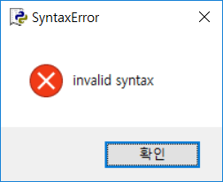

**그림 1-19** 문법 오류 경고창 1

당신이 무엇을 실수했느냐에 따라 문법 오류 경고창의 메시지가 다를 수 있다. 그림 1-20 은 따옴표를 연 뒤에 닫지 않았을 때 발생하는 오류다.

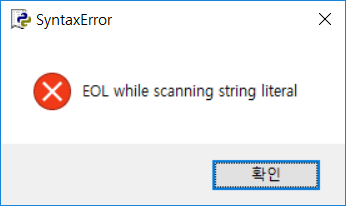

**그림 1-20** 문법 오류 경고창 2

프로그램이 잘 실행되다가 중간에 오류가 발생하기도 한다. 이 때는 프로그램의 실행이 멈추며, 경고창이 출력되는 대신 왼쪽의 쉘 화면에 오류 메시지가 출력된다. ``name``에서 끝에 ``e``를 빠트려서 오류가 발생한 경우를 보여준다.

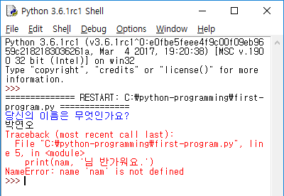

**그림 1-21** 실행 중 오류 발생

프로그래밍을 하다 보면 이 외에도 여러 가지 오류가 발생할 수 있다. 인간은 누구나 실수를 하기 때문에 오류를 범하는 것은 아무리 숙련된 프로그래머라도 피할 수 없는 일이다. 오류가 발생하면 걱정하지 말고 코드를 자세히 살펴보자. 특히 코드에서 빨간색으로 표시된 부분 근처를 잘 확인해보면 보면 틀린 부분을 쉽게 찾을 수 있다.

### 1.3.3 첫 파이썬 프로그램 살펴보기

프로그램을 만들어 실행해 보았지만 아직 프로그램의 의미는 잘 모르는 상태다. 이 프로그램 코드를 살펴보고 파이썬 프로그램의 기본을 알아 보자.

코드 1-2에는 각 행에 번호가 붙어 있다. 이 번호는 파이썬 코드가 아니라 코드를 설명하기 위해 임의로 달아둔 것이다.

    1  # 첫 파이썬 프로그램
    2  
    3  print('당신의 이름은 무엇인가요?')
    4  name = input()
    5  
    6  print(name, '님 반가워요.')

**코드 1-2** 첫 파이썬 프로그램

파이썬 프로그램은 기본적으로 위에서부터 한 행씩 차례대로 실행된다.

1번 행은 샵 기호(``#``)로 시작되었다. 파이썬 코드에서 샵 기호가 나오면 샵 기호 뒤의 내용은 실행되지 않는다. 이것은 프로그램에 메모나 설명을 남기기 위해 사용되는 주석이다. 주석은 실행되지 않기 때문에 불필요하다고 생각할 수도 있지만, 사람이 코드를 더 잘 이해할 수 있게 해주기 때문에 중요하다. 프로그램은 컴퓨터만이 아니라 사람도 쉽게 읽을 수 있어야 한다. 1번 행은 전체가 주석이므로 실행되지 않고 넘어갔다.

2번과 5번 행은 빈 행이다. 빈 행은 실행되지 않고 다음 행으로 넘어간다. 빈 행도 사람이 프로그램을 읽기 쉽도록 할 때 사용된다. 글쓰기에서 의미상 구분이 필요할 때 단락을 나누는 것과 비슷하다.

3번과 6번 행에는 ``print()`` 함수가 사용되었다. ``print()`` 함수는 괄호 안의 내용을 화면에 출력할 때 사용된다. 텍스트를 출력할 때는 ``'당신의 이름은 무엇인가요?'``와 같이 글자를 따옴표(`'`)로 감싸주어야 한다. 따옴표는 다른 프로그램 코드와 텍스트를 구별하기 위한 것이다. 그래서 따옴표 자체는 출력되지 않는다.

4번 행에는 ``input()`` 함수가 사용되었다. ``input()`` 함수는 사용자에게서 키보드로 텍스트를 입력받을 때 사용된다. 사용자가 입력한 데이터는 ``name``이라는 변수에 대입되었다. 변수와 대입에 대해서는 2장에서 설명할 것이다.

이제 프로그램을 다시 한 번 실행해 보면 프로그램의 실행 과정이 약간 이해될 것이다.

파이썬 프로그래밍 실습을 할 때 ``print()`` 함수를 잘 활용해야 한다. 이 함수를 사용하지 않으면 계산을 잘 했더라도 결과를 출력하지 못할 것이다.

### 1.3.4 대화식 쉘 사용하기

파이썬 프로그램 파일을 작성하고 실행시키는 과정이 그렇게 어렵지는 않았을 것이다. 하지만 파이썬을 학습하는 과정에서 수많은 예제를 실행해 볼 텐데, 간단한 예제 하나 하나를 실행할 때마다 파일을 만들고 저장하는 과정을 거친다면 불편하지 않을까? 그런 의문이 들었다면 대화식 쉘을 만나볼 때다.

대화식 쉘은 파이썬 프로그램 파일을 직접 만들지 않고도 간단한 파이썬 코드를 실행해 볼 수 있는 도구다. 대화식 쉘에 파이썬 코드 한 행을 입력하면 마치 메신저로 채팅을 하는 것처럼 대화식 쉘이 코드의 실행 결과를 출력해 준다.

이전 실습에서 IDLE의 창을 둘로 나누어 왼쪽과 오른쪽에 각각 배치해 두었다. 왼쪽 창은 파이썬 파일 편집 창이고, 프로그램의 실행 결과가 출력되었던 오른쪽 창이 대화식 쉘 창이다. 대화식 쉘 창은 프로그램 실행 결과를 출력하는 데도 쓰이지만, 파이썬 코드를 한 행씩 입력하고 계산해보는 용도로도 쓸 수 있다.

대화식 쉘에는 ``>>>`` 라는 기호가 보라색으로 출력되어 있다. 이 기호는 당신이 파이썬 코드를 입력할 수 있다는 뜻이다. 여기에 ``print(1234 + 5678)`` 이라고 입력해 보자.

    >>> print(1234 + 5678)
    6912

입력한 식의 계산 결과가 ``6912``라고 출력될 것이다. 이처럼 대화식 쉘은 파이썬 코드가 한 행 입력될 때마다 바로 그 코드를 실행한다. 프로그램을 작성하고 실행하는 과정을 거치지 않고 바로 결과를 확인할 수 있어 편리하다.

또 한가지 중요한 점이 있다. 대화식 쉘에는 ``print()`` 함수를 사용하지 않아도 코드의 실행 결과가 저절로 화면에 출력된다. ``print()`` 없이 ``1234 + 5678``만 입력해 보면 확인할 수 있다.

    >>> 1234 + 5678
    6912

이처럼 몇 행 안되는 파이썬 코드의 실행 결과가 궁금할 때는 대화식 쉘을 이용하면 된다. 대화식 쉘은 파이썬 프로그래머들이 애용하는 편리한 도구다.

### 1.3.5 프로그램을 만드는 과정

첫 프로그램을 만들어 본 경험에 비춰, 프로그램을 만드는 과정을 정리해 보자.

1. IDLE을 실행한다.
2. 프로그램 코드를 작성해 파일로 저장한다.
3. 프로그램을 작성하는 도중 코드의 실행 결과가 궁금할 때는 대화식 쉘에 입력해 본다.
4. 작성한 프로그램을 실행한다.
5. 오류가 발생한 경우 2로 돌아가 오류를 수정한다.
6. 프로그램의 실행 결과가 만족스러울 때까지 2로 돌아가 프로그램을 개선한다.

이 책에서 연습문제를 풀 때는 이 과정을 따르면 된다.

