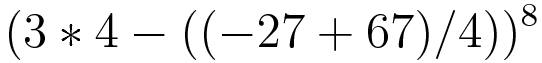
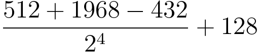
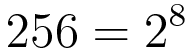
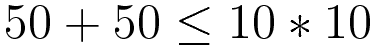
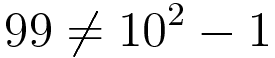
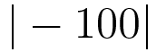
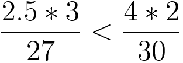
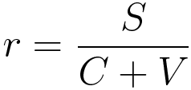

* table of contents
{:toc}

파이썬을 일종의 고급 계산기처럼 사용할 수 있다. 파이썬 코드로 다양한 계산식을 표현할 수 있고, 컴퓨터는 이 식을 그대로 계산해 준다. 다양한 수식을 파이썬으로 계산해 보자.

### 2.1.1 수식 나타내고 계산하기

파이썬에서 수식 계산은 어려울 것이 없다. 1장에서 이미 해 본 것이기도 하다. IDLE을 실행하고, 대화식 쉘에 수식을 입력해 보자. (``>>>`` 이라는 입력 표시가 나와 있는 코드는 모두 대화식 쉘에서 입력하는 예제다. 대화식 쉘의 예제는 당신도 직접 따라 입력해보는 것이 좋다. 샵 기호(``#``) 뒤의 내용은 주석이므로 생략해도 괜찮다.)

    >>> 1917 - 2017
    -100
    >>> 32 * 3.1415  # 별 기호(*)는 곱셈을 의미
    100.528
    >>> 90 / 360     # 빗금 기호(/)는 나눗셈을 의미
    0.25

**코드 2-1** 간단한 수식 계산

코드 2-1에서 확인할 수 있듯이 대화식 쉘에 수식을 입력하면 바로 계산되어 결과가 출력된다.

파이썬에서 수식을 표기하고 계산하는 방법은 수학과 거의 똑같다. 전자계산기를 써 본 적이 있다면 더욱 비슷하게 느껴질 것이다. 단지 곱셈에 별 기호(``*``)를, 나눗셈에 빗금 기호(``/``)를 사용한다는 점은 수학과 다르니 유의하자.

> **참고**
>
> 잠깐, IDLE이 뭐지? 대화식 쉘은 또 뭐야? 이런 의문이 든다면 1장의 내용을 다시 살펴봐야 한다.
>
> IDLE은 파이썬을 설치하면 함께 설치되는 프로그래밍 도구다. 윈도우 환경에서는 시작 메뉴에서 Python -> IDLE 을 찾아 실행하면 된다.
>
> 대화식 쉘은 파이썬 프로그램 파일을 작성하지 않고도 한 행씩 명령을 바로 실행하며 결과를 확인할 수 있는 도구다. IDLE을 실행하면 기본으로 나오는 창이 대화식 쉘 창이다.
>
> 자세한 설명은 1장을 참고하자.

#### 연산자

덧셈 기호(``+``), 뺄셈 기호(``-``)처럼 수를 어떻게 계산해야 하는지 알려주는 기호를 연산자라고 부른다. 파이썬에는 사칙연산을 비롯한 여러 가지 연산자가 있다.

연산자 | 의미
------ | ------------------------
``+``  | 덧셈
``-``  | 뺄셈
``*``  | 곱셈
``/``  | 나눗셈
``**`` | 거듭제곱
``//`` | 몫 (파이썬 3.5부터 지원)
``%``  | 나머지

**표 2-1** 수의 계산을 위한 연산자

표 2-1에 나온 연산자들을 살펴보자. 덧셈, 뺄셈, 곱셈, 나눗셈이야 모르는 사람이 없다. 하지만 거듭제곱, 몫, 나머지를 구하는 연산자는 생소할 것이다. 어떻게 동작하는지 대화식 쉘에 입력해 알아보자.

    >>> 2 ** 8        # 2의 8승
    256
    >>> 10 ** 20      # 10의 20승
    10000000000000000000000000000000000000000
    >>> 9999 ** 9999  # 9999의 9999승
    3678978362165515792692625984783565804550254...(결과 생략)

**코드 2-2** 거듭제곱

보다시피 사람은 감당하기 힘든 거듭제곱도 컴퓨터는 순식간에 계산해 낸다.

이번에는 나눗셈, 몫, 나머지를 비교해 보자.

    >>> 100 / 3   # 나눗셈 연산자는 소수점 아래의 작은 단위까지 구해 준다
    33.333333333333336
    >>> 100 // 3  # 몫 연산자는 몫만 구하고 소수점 아래 자리는 버린다
    33
    >>> 100 % 3   # 나머지 연산자를 이용하면 남은 수를 구할 수 있다
    1

**코드 2-3** 나눗셈, 몫, 나머지

마이너스 기호(``-``)는 뺄셈 연산자로도 쓰이지만, 수의 부호를 바꿀 때도 쓰인다. 마이너스 기호 왼쪽에는 수가 없고 오른쪽에만 수(피연산자)가 있으면, 그 수의 부호를 바꾼다.

    >>> - 100    # 마이너스 - 기호는 수의 부호를 바꾼다
    -100
    >>> - - 100  # 부호를 두 번 바꾸면 원래 수가 된다
    100

**코드 2-4** 부호 바꾸기 연산

지금 소개한 연산자는 모두 수의 계산에 관련된 산술 연산자다. 이 외에도 대입 연산자, 비교 연산자, 논리 연산자 등이 있다. 이들에 대해서도 곧 배울 것이다.

#### 연산 순서

수식은 여러 개의 연산자가 중첩될 수 있고, 얼마든지 길어질 수도 있다. 수식이 길고 복잡해도 하나씩 계산해 나가면 된다. 이 때 중요한 것은 수식의 연산 순서다. 연산 순서에 따라 최종 계산 결과가 달라질 수 있기 때문이다.

1 + 3 / 2 라는 식을 예로 들어보자. 덧셈을 먼저 계산하면 결과가 2 지만, 나눗셈을 먼저 계산하면 결과는 2.5가 된다.

파이썬의 연산 순서는 수학과 똑같다. 왼쪽에서 오른쪽 순으로 계산하되, 곱셈과 나눗셈을 덧셈과 뺄셈보다 먼저 계산하는 것이다. 그러므로 1 + 3 / 2 를 파이썬으로 계산하면 2.5가 된다.

    >>> 1 + 3 / 2  # 나눗셈이 덧셈보다 연산 우선 순위가 높다.
    2.5

**코드 2-5** 연산 우선 순위

연산 순서를 조정하는 방법도 수학과 같다. 먼저(그리고 독립적으로) 계산되어야 할 부분을 괄호로 둘러싸는 것이다. 1 + 3 / 2 식에서 덧셈이 먼저 계산되게 해 보자.

    >>> (1 + 3) / 2  # 괄호로 둘러싼 식이 먼저 계산된다
    2.0
    >>> (20 - 10) + (40 / (-2 - 8))  # 더 복잡한 식도 마찬가지
    6.0

**코드 2-6** 괄호를 이용해 연산 순서 조정하기

#### 연습문제

2장부터는 연습문제가 제공된다. 프로그래밍은 학습은 숙달이 필요한 과정이므로 연습문제를 많이 풀어보는 것이 중요하다.

각 장에는 연습문제가 있고, 번호가 매겨져 있다. 연습문제를 풀 때는 프로그램의 파일명을 ``exercise-2-2.py``와 같이 exercise-에 연습문제의 번호를 붙여서 짓도록 하자. 프로그램 파일을 만들고 저장한 후, 실행해서 출력 결과까지 올바른지 확인해야 한다.

**연습문제 2-1** 수식 계산 1

다음 수식을 파이썬 프로그램으로 작성하고 계산 결과를 출력하라.

힌트: 대화식 쉘은 수식 계산 결과를 자동으로 출력해준다. 하지만 프로그램 파일을 작성할 때는 출력 명령을 당신이 직접 내려야 한다. 화면에 결과를 출력하는 방법이 기억나지 않는다면 1장을 참고하자.

**연습문제 2-2** 수식 계산 2

다음 수식을 파이썬 프로그램으로 작성하고 계산 결과를 출력하라.

힌트: 식이 복잡해 작성하기 어려울 때는 대화식 쉘에 한 부분씩 입력하며 중간 결과를 확인하면 도움이 된다.

**연습문제 2-3** 수식 계산 3

다음 수식을 파이썬 프로그램으로 작성하고 계산 결과를 출력하라.

### 2.1.2 등식과 부등식

수학에서 등식과 부등식은 수의 크기를 비교할 때 사용된다. 파이썬에서도 등식과 부등식을 표현할 수 있고, 컴퓨터는 그 식이 참인지 거짓인지 계산해 준다. 코드 2-7은 여러 가지 등식과 부등식을 파이썬으로 나타내고 계산한 것이다. 당신도 대화식 쉘에 입력하여 계산해 보자.

    >>> 1+2 == 3  # 양변이 같다 (== 등호가 2개인 것에 주의)
    True
    >>> 1+2 != 4  # 양변이 다르다 (!=)
    True
    >>> 1 < 2     # 좌변이 우변보다 작다 (<)
    True
    >>> 1 > 2     # 좌변이 우변보다 크다 (>)
    False
    >>> 1 < 2 < 3 < 4  # 여러 수를 한 행에서 비교할 수도 있다
    True

**코드 2-7** 등식과 부등식

코드 2-7에서 보는 것처럼, 등식과 부등식의 계산 결과는 ``True`` 또는 ``False``다. ``True``는 식의 계산 결과가 참임을, ``False``는 식의 계산 결과가 거짓임을 의미한다.

``==``, ``<`` 처럼 등식과 부등식에서 데이터를 비교할 때 사용되는 연산자를 **비교 연산자**라고 부른다. 양변이 같음을 의미하는 연산자는 ``==`` 이다. 등호를 두 개 붙여 쓴다. 다음 절에서 배울 등호를 하나만 쓰는 대입 연산자(``=``)와는 다르므로 등호 개수를 잘 구별하자. 양변이 다름을 의미하는 연산자는 ``!=``이다. 느낌표와 등호를 붙여 쓴다. 자주 사용되므로 잘 기억해 두자.

비교 연산자는 이 외에도 몇 개가 더 있다. 표 2-2를 참고하자.

연산자 | 의미
------ | -----------------------------------------
``==`` | 양변이 같다
``!=`` | 양변이 다르다
``<``  | 좌변이 우변보다 작다 (미만)
``<=`` | 좌변이 우변보다 작거나 양변이 같다 (이하)
``>``  | 좌변이 우변보다 크다 (초과)
``>=`` | 좌변이 우변보다 크거나 양변이 같다 (이상)

**표 2-2** 비교 연산자

비교 연산은 컴퓨터를 이용해 어떤 사실을 판단하고 조건에 따른 처리를 하는 데 중요한 역할을 한다. 이에 관해서는 4장과 5장에서 더 자세히 알아볼 것이다.

#### 연습문제

**연습문제 2-4** 수식 계산 4

다음 수식을 파이썬 프로그램으로 작성하고 계산 결과를 출력하라.

**연습문제 2-5** 수식 계산 5

다음 수식을 파이썬 프로그램으로 작성하고 계산 결과를 출력하라.

**연습문제 2-6** 수식 계산 6

다음 수식을 파이썬 프로그램으로 작성하고 계산 결과를 출력하라.

### 2.1.3 함수를 이용한 계산

수학에는 다양한 계산법이 있기 때문에 수식을 풀다보면 사칙연산만으로는 부족한 상황을 겪게 될 것이다. 산술 연산에 할당할 수 있는 기호는 한정되어 있으므로 산술 연산자 외의 연산은 함수로 제공된다. 이 절에서는 가장 자주 사용되는 몇 가지 수학 함수를 소개한다.

당신은 함수를 이미 사용해 본 적이 있다. 1장에서 배운 화면에 텍스트를 출력하는 함수 ``print()``가 그것이다. ``print()`` 함수와 다른 함수의 사용법은 동일하다. 함수 이름 뒤의 괄호 안에 함수를 이용해 연산을 수행할 데이터를 넣어주면 된다. 예를 들어, ``print(10)`` 을 실행하면 화면에 10이 출력된다. 이 방법을 염두에 두고 다음 내용을 살펴보자. 계속 강조하는 것이지만, 대화식 쉘에 직접 따라 입력해 보는 것이 중요하다.

#### 절대값

``abs()`` 함수를 사용하면 수의 절대값을 구할 수 있다. 'abs' 라는 함수 이름은 절대값을 의미하는 영어 용어 'the absolute value'에서 딴 것이다. 절대값을 구하려는 수를 괄호 안에 넣어 계산하면 된다.

    >>> abs(10)   # 양의 정수 10의 절대값
    10
    >>> abs(-10)  # 음의 정수 -10의 절대값
    10

**코드 2-8** ``abs()`` 함수로 절대값 구하기

#### 소수 반올림

소수를 반올림할 때는 ``round()`` 함수를 사용한다. 'round'는 반올림을 뜻하는 영어 용어 'round off'에서 딴 이름이다. 반올림 위치를 지정하려면 ``round(수, 자리수)``와 같이 콤마(``,``) 뒤에 반올림 위치의 수를 적어준다. 자리수를 지정하지 않으면 정수로 반올림된다. 코드 2-9를 대화식 쉘에 입력해보자.

    >>> round(3.141527)     # 소수를 정수로 반올림
    3
    >>> round(3.141527, 2)  # 소수점 둘째 자리까지 반올림
    3.14
    >>> round(3.141527, 4)  # 소수점 넷째 자리까지 반올림
    3.1415
    >>> round(10 / 6)       # 소수로 계산되는 식의 반올림
    2

**코드 2-9** ``round()`` 함수로 소수 반올림

#### 제곱근 

``abs()`` 함수와 ``round()`` 함수는 파이썬의 내장 함수여서 기본으로 사용할 수 있다. 하지만 내장 함수가 아닌 함수도 있다. 제곱근을 구하는 함수는 math 라는 확장 모듈에 정의되어 있어서, 사용하기 전에 math 확장 모듈을 사용할 것임을 밝혀야 한다. ``import math``라는 코드를 한번만 실행해 두면 그 뒤로 math 모듈을 사용할 수 있다. 모듈과 import 문에 관해서는 **10장 모듈과 패키지**에서 자세히 배울 것이므로 지금은 ``math.``으로 시작되는 함수를 사용하기 전에 ``import math``를 실행해야 한다는 것만 기억하자.

제곱근을 구하는 함수는 ``math.sqrt()`` 다. 'sqrt'라는 이름은 제곱근을 뜻하는 영어 단어 'square root'에서 딴 것이다. ``import math``를 실행해야 한다는 것을 잊지 말고, 제곱근을 구하는 함수 ``math.sqrt()``를 사용해 보자.

    >>> import math   # 앞으로 math 모듈을 사용할 것이다
    >>> math.sqrt(2)  # 4의 제곱근
    1.4142135623730951
    >>> math.sqrt(9)  # 9의 제곱근
    2.0

**코드 2-10** ``math.sqrt()`` 함수로 제곱근 구하기

#### 연습문제

**연습문제 2-7** 수식 계산 7

다음 수식을 파이썬 프로그램으로 작성하고 계산 결과를 출력하라.

**연습문제 2-8** 수식 계산 8

다음 수식을 소수점 둘째 자리까지만 계산하여 파이썬 프로그램으로 출력하라.

힌트: math 모듈의 함수 ``math.sqrt()``를 사용하려면 먼저 ``import math`` 명령으로 math 모듈을 임포트해야 한다.

힌트: 반올림은 ``round()`` 함수를 이용하고, 자리수를 지정하려면 ``round(수, 자리수)``와 같은 형태로 지정한다.

### 2.1.4 수식을 응용한 문제

#### 현실의 문제는 수식으로 제공되지 않는다

프로그래머가 해결해야 하는 현실의 문제는 수식의 형태로 제공되지 않는다. 당신은 "100 / 3" 이라는 수식 대신 "학생 100명을 3개의 학급에 균등하게 나누어 주세요" 라는 요청을 받을 것이다. 물론 현실의 문제는 이보다는 더 복잡하겠지만 말이다.

파이썬을 이용해 현실의 문제를 한 번 해결해 보자. 다음은 현실의 문제의 한 예다.

> 대학생 김파이 씨는 자취방을 구하고 있다. 열심히 발품을 팔며 조사한 끝에 가장 마음에 드는 방 두 개를 찾았다.
>
> 방 A는 가로 2.5m, 세로 3m이고, 월세 27만원이다.
>
> 방 B는 가로 4m, 세로 2m이고, 월세 30만원이다.
>
> 김파이 씨는 어느 방이 가격 대비 더 넓은지를 알고 싶다. 김파이 씨를 도와주세요.

이 문제는 수식이 아니라 자연어로 제공되었다. 따라서 프로그래머가 직접 문제를 해석하여 수식을 작성해야 한다. 다행히 문제가 명확하게 정의되어 있고, 문제를 해결하는 방법도 간단하다. 직각사각형의 넓이를 구하는 식(가로길이 x 세로길이)만 알면 다음과 같이 쉽게 비교식을 만들 수 있다.

이 식을 계산한 결과가 참이라면 방 B가 가격대비 더 넓은 것이고, 거짓이라면 방 A가 더 넓은 것이다. 이걸 계산할 생각을 하니 골치가 아프지는 않은가? 걱정 마라. 계산은 컴퓨터의 몫이다.

이 수식을 대화식 쉘에 입력해 계산해 보자. 계산결과가 거짓이므로, 방 A가 가격대비 더 넓다는 것을 알 수 있다.

    >>> (2.5 * 3 / 27) < (4 * 2 / 30)
    False

**코드 2-11** 두 방의 넓이 비교

이렇게 현실의 문제를 해결할 때는 먼저 수식으로 나타낸 뒤, 프로그램으로 옮겨 계산하면 된다.

> **참고**
>
> 프로그래밍 언어는 문제를 컴퓨터가 이해할 수 있는 형식으로 정의하기 위한 규칙일 뿐이다. 프로그래밍 학습은 언어의 규칙 학습만으로 끝나지 않는다. 현실의 문제를 추상화하여 프로그래밍 언어로 나타내는 기술은 프로그램을 많이 작성해보는 연습을 통해 키워나가야 한다.
>
> 문제 해결 기술을 더 체계적으로 학습하고 싶다면 프로그래밍 언어 학습 후에 **알고리즘(algorithm)**, **데이터 구조(data structure)**, **프로그램 디자인(program design)** 같은 과목을 학습해야 한다. 이런 과목은 대학교의 컴퓨터 과학 전공 2-3학년에 편성된다. 지금은 입문 단계이니 기초를 다지는 데 집중하자.

#### 도메인 지식

프로그래밍을 잘 하는 사람은 모든 문제를 해결할 수 있을까? 아쉽지만 현실의 문제를 해결할 때는 프로그래밍 지식만으로는 불충분할 때가 많다. 다음 문제를 통해 생각해보자.

> 주식회사 파이중공업은 한 해 동안 철강, 석유 등의 원자재(불변자본)를 구매하는 데 30억 원을, 노동자를 고용(가변자본)하는 데 15억 원을 사용했다. 파이중공업은 이를 통해 선박을 제조·판매하여 45억 원의 순수익(잉여가치)을 냈다.
>
> 파이중공업의 한 해 이윤율은 얼마인가?

방 넓이 계산 문제와 마찬가지로 이 문제도 프로그래머가 문제를 해석하여 수식을 작성해야 한다. 그런데 이 문제는 완전하지 않다. 이윤율을 어떻게 구할 수 있는지에 대한 정보가 없기 때문이다. 이렇게 현실에서 제기되는 문제에는 필요한 정보가 충분히 제공되지 않는 경우가 많다. 문제 해결을 요청한 사람은 해당 분야의 지식이 당연해서 생략했지만 프로그래머에게는 그런 지식이 없는 것이다.

이처럼 문제를 해결하기 위해 필요한 지식이지만 프로그래밍 자체와 관련된 지식이 아니라 문제 자체와 관련된 지식을 도메인 지식(domain knowledge)이라고 한다. 도메인 지식이 없을 때는 문제 해결을 요청한 당사자에게 필요한 정보를 추가로 요구하거나, 문제를 해결하기 위한 지식을 직접 찾아보아야 한다.

위키백과에서 이윤율을 검색해보면, '이윤율의 경향적 저하 법칙'이라는 문서에서 이윤율 공식을 찾을 수 있다.

r이 이윤율, C가 불변자본, V가 가변자본, S가 잉여가치액이므로, 이 문제는 다음과 같이 계산할 수 있다. 계산결과는 1.0이다.

    >>> 45 / (30 + 15)
    1.0

**코드 2-12** 파이중공업의 이윤율 계산

도메인 지식은 현실의 프로그래밍에 반드시 필요하다. 하지만 프로그래머가 모든 분야의 지식을 알 수는 없다. 그러므로 프로그래밍에는 필요한 정보를 잘 찾아내고 학습하는 능력과, 문제 해결을 요구하는 사람(프로그램을 사용하는 사람)과 잘 대화하는 능력이 필요하다.

#### 연습문제

현실의 문제를 수식을 세워 해결하는 방법을 연습해 보자.

**연습문제 2-9** 환율 계산

한국에 사는 당신은 외국 인터넷 쇼핑몰에서 노트북을 구매하려 한다. 이 쇼핑몰에서는 달러(USD) 또는 유로(USD)로 결제할 수 있고, 노트북의 가격은 780 달러 또는 650 유로다. 달러로 사는 것과 유로로 사는 것 중 어느 쪽이 더 저렴한가?

이 문제를 파이썬 프로그램을 작성하여 해결해 보아라. 인터넷 검색을 통해 현재의 '달러->원' 환율과 '유로->원' 환율을 조사한 후 계산하라.

힌트: 구글에 '1달러' 라고 검색하면 달러 가격이 원화로 계산된다. 환율 정보 사이트를 확인해도 된다.

**연습문제 2-10** 원형 운동장

당신이 다니는 학교의 운동장은 원형이고 지름이 100m다. 어느 체육 시간, 두 명씩 나란히 운동장을 한 바퀴 달리는 시합을 하게 되었다. 그런데 안쪽 선수는 바깥쪽 선수보다 5m 안쪽에서 달린다. 당신은 바깥 쪽에서 달리는 선수가 불리하다고 이의를 제기했다. 바깥쪽 선수가 안쪽 선수보다 몇 미터 더 달려야 하기 때문인가?

이 문제를 파이썬 프로그램을 작성하여 해결해 보아라.

