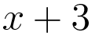
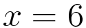
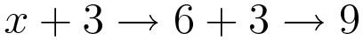

* table of contents
{:toc}

컴퓨터를 수학자들이 발명했다는 것을 기억하는가? 프로그래밍은 수학에서 많은 개념을 가져 왔다. 대수학의 주요 개념인 변수(variable)도 그 중 하나다. 하지만 프로그래밍의 변수는 수학의 변수 그 이상이다. 변수가 프로그래밍에서 어떻게 활용되는지 살펴보자.

### 2.2.1 수학의 변수와 프로그래밍의 변수

#### 수학의 변수

컴퓨터 프로그래밍의 변수를 알아보기 위해, 먼저 수학의 변수가 무엇인지 기억을 떠올려 보자.

위의 식에서 3은 고정된 상수이고, x는 값이 정해지지 않은 변수다. 이처럼 수학의 변수는 식에서 값이 정해지지 않은 수(미지수)를 나타낸다.

식을 계산하기 위해서는 변수의 값이 특정되어야 한다. 변수의 값을 특정한 수로 바꾸는 것을 **대입**이라고 한다.

변수 x에 수 6을 대입해 보자. 수학에서 대입을 할 때는 등호(``=``)를 이용하므로, 다음과 같이 나타낼 수 있다.

이제 x에 6을 대입했으므로, x + 3이라는 식을 계산할 수가 있다. 계산결과는 물론 9다.

정리해보자.

1. 수학의 변수는 값이 정해지지 않은 수를 나타낸다.
2. 대입은 변수의 값을 특정하는 것이다.
3. 변수에 값을 대입하면 변수가 포함된 식을 계산할 수 있다.

#### 프로그래밍의 변수

프로그래밍의 변수는 수학의 변수와 닮았다. 파이썬에서 변수를 직접 사용해 보면 바로 알 수 있다.

IDLE을 실행하고, 대화식 쉘에 ``x + 3``이라는 식을 입력하여 계산해 보자.

    >>> x + 3
    Traceback (most recent call last):
      File "<stdin>", line 1, in <module>
    NameError: name 'x' is not defined

**코드 2-13** x + 3을 계산하면 오류가 발생한다

오류가 발생했다. 마지막 행의 오류 메시지를 번역해보면 "이름 오류: 이름 'x'가 정의되지 않았습니다." 라는 뜻이다.

파이썬에서도 수학과 마찬가지로 x + 3 식을 계산하려면 변수 x의 값이 특정되어야 하는데, x가 무엇인지 정의되지 않았기 때문에 계산할 수 없는 것이다.

변수 x에 6을 대입해 보자. 파이썬에서 변수에 값을 대입할 때는 수학에서처럼 등호(``=``)를 이용한다. 예를 들어, 변수 x에 6을 대입하려면 ``x = 6``이라고 입력하면 된다.

    >>> x = 6  # 변수 x에 6을 대입

**코드 2-14** 변수 x에 6을 대입

대입 명령을 실행하면 출력 결과가 없어 아무 일도 일어나지 않은 것처럼 보인다. 하지만 이제 ``x + 3`` 식을 계산해보면 이전과는 달리 오류 없이 계산될 것이다.

    >>> x + 3  # 아까는 계산할 수 없었던 식이 이제 계산된다
    9

**코드 2-15** x + 3의 계산

이번에는 성공적으로 식이 계산되었다. x에 6을 대입했으므로, x + 3 식에서 x는 6으로 평가되고, 이 식은 6 + 3 이 된다. 식을 계산한 결과는 9다.

이처럼 프로그래밍의 변수는 수학의 변수처럼 대입을 통해 특정한 값으로 치환되는 수다.

### 2.2.2 대입하고 참조하기

#### 대입문과 대입 연산자

``x = 6``과 같이, 변수에 값을 대입할 때 사용되는 명령을 **대입문**이라고 한다. 대입문에 사용되는 등호(``=``)가 **대입 연산자**다. 대입 연산자를 기준으로 왼쪽에 변수를 적고 오른쪽에 변수에 대입될 값을 적어주면, 변수에 값이 대입된다.

예를 들어, x에 6을, y에 10을, z에 5를 대입하는 대입문은 각각 아래와 같이 표현할 수 있다.

    >>> x = 6   # 변수 x에 6을 대입
    >>> y = 10  # 변수 y에 10을 대입
    >>> z = 5   # 변수 z에 5를 대입

**코드 2-16** 여러 변수에 대입하기

여러 개의 변수에 각각의 값을 대입하는 대입문을, 아래와 같이 콤마(``,``)를 이용해 한 행에 쓸 수도 있다.

    >>> x, y, z = 6, 10, 5  # 변수 x, y, z에 각각 6, 10, 5를 대입

**코드 2-17** 하나의 대입문으로 여러 변수에 대입하기

하지만 특별한 이유가 없다면 한 행에는 변수 하나에 값 하나를 대입하는 형태로 코드를 작성하자. 행 수는 좀 많아지겠지만 코드를 읽기 더 좋다.

대입 연산자(``=``)는 양변이 같음을 뜻하는 연산자 ``==``와 헷갈리기 쉽다. 등호의 개수가 다르고 의미도 다르므로 잘 구별하도록 하자.

#### 변수에 대입된 값을 참조하기

변수에 값을 대입한 뒤에는 변수를 통해 대입된 값을 대신할 수 있다. 이렇게 변수에 대입된 값을 사용하는 것을 **참조**라고 한다.

변수에 대입된 값을 참조하는 것은 간단하다. 파이썬 프로그램이 실행될 때 코드에 변수의 이름이 나오면 저절로 변수에 대입된 값으로 계산된다. 그러므로 변수의 이름을 쓰기만 하면 참조가 이루어진다. 앞에서 변수 x, y, z에 대입한 값을 각각 참조해 보자.

    >>> x  # 변수 x에 대입된 값을 참조
    6
    >>> y  # 변수 y에 대입된 값을 참조
    10
    >>> z  # 변수 z에 대입된 값을 참조
    5
    >>> x + y - z  # 변수의 값을 참조하여 계산에 활용
    11

**코드 2-18** 변수의 값 참조

당연한 말이지만, 변수의 값을 참조하려면 먼저 변수에 값이 대입되어 있어야 한다. 값이 대입되지 않았다면 아래처럼 이름 오류가 발생한다.

    >>> w  # 오류: w라는 이름으로 값을 대입한 적이 없으므로 참조할 수 없다
    Traceback (most recent call last):
      File "<stdin>", line 1, in <module>
    NameError: name 'w' is not defined

**코드 2-19** 대입하지 않은 변수를 참조하는 오류

### 2.2.3 대입된 값 바꾸기

지금까지 변수에 값을 대입하고 참조하는 방법을 알아보았다. 이제 변수의 값을 다른 것으로 바꾸는 방법을 알아보자.

#### 변수에 새로운 값 대입

변수의 값을 바꾸는 가장 간단한 방법은 변수에 새로운 값을 대입하는 것이다.

변수 x에 1을 대입한 뒤, 새로운 값을 대입하여 확인해 보자.

    >>> x = 1  # 변수 x에 1을 대입
    >>> x      # 변수 x의 값을 확인
    1
    >>> x = 2  # 변수 x에 새로운 값을 대입
    >>> x      # 변수 x의 값을 확인: 값이 바뀌었다
    2

**코드 2-20** 변수에 새로운 값을 대입하기

변수에 새로운 값을 대입하면 그때부터 변수는 새로운 값으로 계산된다. 원래 대입되어 있던 값은 버려진다. 직관적이다.

#### 변수의 값 수정하기

프로그래밍에서는 변수의 기존 값을 참조해 그 값을 변경한 후 변수에 다시 대입해야 하는 경우가 많다.

예를 들면, 변수 x에 1을 더하고 싶을 수 있다. 이럴 때는 코드 2-21처럼 대입 연산자의 우변에 변수를 참조하여 다시 대입하면 된다.

    >>> x = x + 1  # 변수 x에 x + 1의 계산 결과를 대입
    >>> x          # 변수 x의 값을 확인
    3
    >>> x = x * x  # 변수 x에 x * x의 계산 결과를 대입
    >>> x          # 변수 x의 값을 확인
    9

**코드 2-21** 변수를 참조하는 대입문

``x = x + 1``이라는 식이 혼란스러울 수도 있다. 수학에서 등호는 양 변이 같다는 뜻이기 때문이다. 하지만 파이썬에서 ``=``는 대입 연산자이지 양변이 같음을 의미하는 것이 아니다. 프로그램에서 변수에 대입된 값은 시간이 흐름에 따라 달라질 수 있다. ``x = x + 1``이 실행되기 전에 x에 대입된 값과, 실행된 후 x에 대입된 값은 서로 다르다.

코드 2-21에서 해본 것처럼, 변수의 값을 참조해 새로운 값으로 계산한 후 다시 대입하는 경우가 많다. 파이썬에는 이것을 단축 표현하게 해 주는 **수정 대입 연산자**가 있다. 코드 2-22를 확인해 보자.

    >>> x -= 5  # x = x - 5 과 동일한 의미
    >>> x
    4
    >>> x /= 2  # x = x / 2 와 동일한 의미
    >>> x
    2.0

**코드 2-22** 수정 대입 연산자

수정 대입 연산자는 산술 연산자에 대응한다. 표 2-3을 참고하자.

연산자  | 의미
------- | ----------------------------
``+=``  | 수를 더한 후 다시 대입
``-=``  | 수를 뺀 후 다시 대입
``*=``  | 수를 곱한 후 다시 대입
``/=``  | 수를 나눈 후 다시 대입
``**=`` | 수를 거듭제곱한 후 다시 대입
``//=`` | 수를 나눈 후 몫을 대입
``%=``  | 수를 나눈 후 나머지를 대입

**표 2-3** 수정 대입 연산자

이것들을 일일이 다 외울 필요는 없다. 수를 계산하는 연산 기호가 먼저 나오고, 등호가 뒤따라 나온다는 것만 기억하면 된다. 특히 많이 사용되는 것은 ``+=``와 ``-=``이므로 이 둘만 기억해도 충분하다.

#### 연습문제

**연습문제 2-11** 변수 사용 연습 1

다음 프로그램에서 출력 결과가 True가 되도록 변수 x에 대입할 값을 수정하라.

    x = ?  # 이 행을 수정하시오
    print(x + 7 == 10)

**연습문제 2-12** 변수 사용 연습 2

다음 프로그램의 출력 결과를 예상해 보고, 실제 실행 결과와 비교해 보라.

    x, y = 4, 8
    print(x)
    x *= y
    print(x)
    x -= y
    print(x)

### 2.2.4 변수는 이름이다

사물과 개념에 이름을 부여하는 것은 모든 학문과 지식의 출발점이다. 프로그래밍 활동에서도 이름을 붙이는 것은 매우 중요한 요소다. 이름이 없다면 그것을 가리킬 방법이 없다. 변수를 이용하면 사물에 이름을 붙이고 부를 수 있다.

#### 이름의 중요성

일반적으로 수학의 변수에는 x, y, z처럼 의미 없는 이름이 붙는다. 그렇다면 프로그래밍에서도 그런 식으로 변수의 이름을 붙여도 될까?

누군가가 만든 프로그램을 읽는 중에, 코드 2-23과 같은 코드가 나왔다고 생각해 보자.

    a = 3.14
    b = 10 * 10 * a
    print(b)

**코드 2-23** 변수의 의미가 불분명한 프로그램

이 프로그램에서 변수 a와 변수 b의 의미는 무엇일까? a와 b라는 이름에는 아무런 의미가 없기 때문에 변수에 대입된 값을 토대로 의미를 추측할 수밖에 없다. a는 원주율의 근사값도, 이번 학기 평점 평균도, 어쩌면 대한민국 국민 일인당 월 평균 치킨 섭취량도 의미할 수 있다. 수 자체만으로는 그 의미를 명확히 알 수 없는 것이다.

반면에 코드 2-24처럼 수에 올바른 이름이 붙어있다면 프로그램을 이해하기가 훨씬 쉽다. 변수 '원주율'은 원주율을, 변수 '면적'은 면적을 나타낸다는 것을 변수의 이름만으로도 알 수 있다.

    원주율 = 3.14
    면적 = 10 * 10 * 원주율
    print(면적)

**코드 2-24** 변수의 의미가 분명한 프로그램

이름 없는 수는 의미를 알기 어렵다. 프로그램은 컴퓨터가 한 번 계산하고 끝나는 것이 아니라, 프로그래머들도 계속 읽고 수정한다. 나중에 코드를 읽을 사람들을 위해, 의미 있는 모든 수에 의미 있는 이름을 붙여야 한다.

#### 이름 지을 때 지켜야 할 규칙

변수의 이름을 가리키는 정식 프로그래밍 용어는 **식별자**다. 프로그래머는 프로그램 안의 모든 대상(수, 텍스트, 집합, 함수, 클래스, 메소드 등)에 식별자(이름)를 붙일 수 있다.

식별자들은 이름공간을 공유하기 때문에, 변수의 이름을 지을 때는 다른 식별자와 서로 겹치지 않게 주의해야 한다. 그리고 식별자가 다른 수, 연산자 등과 겹치지 않도록 식별자를 지을 때 제약이 있다.

식별자에는 숫자, 알파벳, 밑줄 기호(``_``), 한글 등 다양한 문자를 사용할 수 있다. 하지만 연산자로 사용되는 기호(``+``, ``-``, ``=`` 등)와 공백 문자는 사용할 수 없다. 식별자가 숫자로 시작해서도 안 된다. 파이썬의 문법을 구성하는 시스템 예약어(``for``, ``if``, ``while``, ``range``, ``type`` 등)도 식별자로 사용할 수 없다.

코드 2-25와 코드 2-26에는 올바른 식별자와 잘못된 식별자의 예가 나와 있다. 대화식 쉘에 입력해 보자. 특히, 코드 2-26에서 어떤 오류가 발생하는지도 확인하도록 하자.

    >>> speed = 72       # 영문자를 사용할 수 있다
    >>> my_height = 175  # 숫자, 언더스코어를 사용할 수 있다
    >>> 원주율 = 3.14    # 한글을 사용할 수 있다 (권장하지는 않는다)

**코드 2-25** 사용할 수 있는 식별자의 예

    >>> 나의 신장 = 175  # 공백 문자는 사용할 수 없다
    >>> one+one = 2      # 연산자로 사용되는 기호는 사용할 수 없다
    >>> 10 = 20          # 숫자로만 구성된 이름은 사용할 수 없다
    >>> 3hours = 180     # 숫자로 시작하는 이름은 사용할 수 없다
    >>> for = 10         # 시스템 예약어는 사용할 수 없다

**코드 2-26** 사용할 수 없는 식별자의 예 (오류 메시지 생략)

파이썬 3에서는 식별자 이름을 한글로 지어도 된다. 그러나 한국어를 사용하지 않는 사람이 프로그램을 열어 볼 가능성이 있다면, 영문만 사용하는 편이 좋다.

### 2.2.5 데이터 기억하기

변수를 이용하면 수에 이름을 붙여 다시 부를 수 있다. 이름이 붙은 수는 이름을 통해 다시 부를 수 있기 때문에, 컴퓨터가 당신 대신 그 수를 기억해주는 셈이 된다. 즉, 변수를 이용하면 데이터를 기억할 수 있다.

#### 중간 계산 결과 기억하기

미국 심리학자 조지 밀러(George Armitage Miller, 1920-2012)의 연구에 따르면, 인간의 단기기억 용량은 7±2개라고 한다. 머리 좋은 사람도 기껏해야 한꺼번에 아홉 개밖에 기억하지 못하는 것이다. 그러므로 뭔가 많이 기억해야 할 때는 때는 인간의 기억력에 의존하지 않는 편이 좋다.

코드 2-27은 매일 빵을 여러 개 먹는 김파이 씨가 사흘 동안 빵을 통해 섭취하는 칼로리 총량이 얼마인지 계산하는 프로그램이다.

    빵_칼로리 = 223.5  # 김파이 씨가 먹는 빵 1개의 칼로리
    
    day_1 = 빵_칼로리 * 4  # 첫째 날: 빵 4개
    day_2 = 빵_칼로리 * 5  # 둘째 날: 빵 5개
    day_3 = 빵_칼로리 * 3  # 셋째 날: 빵 3개
    
    칼로리_총량 = day_1 + day_2 + day_3
    
    print(칼로리_총량)

**코드 2-27** 칼로리 계산 1

코드 2-27은 변수의 두 가지 활용법을 보여준다.

1. 빵의 칼로리를 매번 223.5라는 수로 쓰는 대신, ``빵_칼로리``라는 변수에 대입해 이름으로 나타냈다. 의미 있는 수에 의미 있는 이름을 붙여라. 이것은 앞 절에서 배운 것이다.
2. ``day_1``, ``day_2``, ``day_3``이라는 변수에 하루 동안 빵을 통해 섭취한 칼로리를 대입해 두었다가, 칼로리_총량을 구할 때 참조했다. 변수를 이용해 중간 계산 결과를 기억한 것이다. 지면을 절약하기 위해 사흘치만 나타냈지만, 몇 줄 더 작성하면 한 달 치도 충분히 계산할 수 있다.

이렇게 변수를 이용해 복잡한 문제를 의미 있는 단계별로 나눠 계산할 수 있다. 이 과정을 정리해 보자.

1. 먼저 계산식을 여러 단계로 나눈다.
2. 나누어진 계산식의 중간 계산 결과는 변수에 대입해 둔다.
3. 다음 단계의 계산에서 변수에 대입된 중간 계산 결과를 참조한다.

#### 중간 계산 결과 누적하기

**2.2.3 변수에 대입된 값 바꾸기**에서 배운 것처럼, 변수에 대입한 수를 수정하는 것이 가능하다. 이를 이용하면 중간 계산 결과를 변수에 누적하는 방식으로 계산할 수도 있다. 다음 프로그램을 보자.

    빵_칼로리 = 223.5  # 김파이 씨가 먹는 빵 1개의 칼로리
    
    칼로리_총량 = 0  # 칼로리 총량의 초기값
    
    칼로리_총량 += 빵_칼로리 * 4  # 첫째 날: 빵 4개
    칼로리_총량 += 빵_칼로리 * 5  # 둘째 날: 빵 5개
    칼로리_총량 += 빵_칼로리 * 3  # 셋째 날: 빵 3개
    
    print(칼로리_총량)

**코드 2-28** 칼로리 계산 2

코드 2-27과 코드 2-28의 최종 계산 결과는 동일하지만 중간 계산 과정은 조금 다르다. 코드 2-28은 중간 계산 결과를 ``day_1``과 같은 별도의 변수에 대입하지 않고, ``칼로리_총량``이라는 하나의 변수에 하루씩 누적하여 계산했다. 중간 계산 결과를 나중에 불러낼 필요가 없거나, 각 단계별로 누적된 데이터 자체가 중요할 때는 이렇게 하나의 변수에 계산결과를 누적하는 방법도 많이 사용된다.

둘 중 어떤 것이 더 좋은 방식일까? 그건 상황에 따라 다르다. 만약 매일매일의 칼로리 섭취량을 각각 출력해야 한다면 일별 칼로리 섭취량을 불러낼 수 있는 코드 2-27의 방식이 더 적합할 것이고, 매일매일 증가된 칼로리 누적 총량을 출력해야 한다면 코드 2-28의 방식이 더 적합할 것이다.

#### 사용자의 입력 보관하기

1장에서 첫 파이썬 프로그램을 만들었을 때, ``input()`` 함수를 이용해 사용자의 입력을 받아 보았다. 그 때 작성한 코드를 다시 보자.

    print('당신의 이름은 무엇인가요?')
    name = input()

**코드 2-29** 사용자에게 입력받기

두 번째 행에서 ``input()`` 함수의 계산 결과를 변수 ``name``에 대입했다는 점을 잘 보자. 만일 이렇게 대입하지 않는다면, ``input()`` 함수를 통해 사용자로부터 입력받은 데이터는 다시 부를 방법이 없게 될 것이다.

이처럼 사용자가 입력한 데이터, 파일에서 읽은 데이터, 네트워크에서 수신한 데이터 등 프로그램 밖에서 읽어들인 데이터를 보관해 두었다가 다시 참조할 때도 변수가 사용된다.

#### 사용자가 입력한 수 계산하기

지금까지는 컴퓨터가 계산할 수를 프로그램 안에 직접 써 넣었다. 그려면 수를 바꿀 때마다 프로그램을 수정해야 하므로 프로그램의 용도가 너무 제한된다. 이것은 컴퓨터 프로그램이라기보다는 일회용 계산에 더 가깝다.

실제 프로그램은 사용자가 무언가를 입력하고 그에 따라 결과가 달라지는 것이 대부분이다. 1장에서 만들어 본 좋아하는 장소와 특산물을 입력받아 출력하는 프로그램도 무척 단순하긴 했지만 그런 프로그램이었다. 수식을 계산할 때도 사용자가 원하는 수를 입력해 계산되도록 하면 좋지 않을까?

앞 절에서 재차 확인한 것처럼, ``input()`` 함수를 이용하면 사용자에게서 텍스트 데이터를 입력받을 수 있다. 그러나, 사용자에게 텍스트가 아니라 수를 입력받을 때는 입력받는 방법이 조금 다르다. 코드 2-30을 대화식 쉘에 입력해 보자.

    >>> text = input()           # 텍스트 입력받기: input() 함수만 쓴다
    10
    >>> text                     # 입력받은 텍스트 확인: 따옴표로 둘러싸여 있다
    '10'
    >>> number = int(input())    # 정수 입력받기: int() 함수로 감싼다
    10
    >>> number                   # 입력받은 정수 확인: 따옴표가 없다
    10

**코드 2-30** 사용자에게 수 입력받기

``input()`` 함수는 사용자가 입력한 데이터를 텍스트 데이터로 돌려준다. 입력받은 텍스트 데이터를 수로 사용하려면, ``int()`` 함수를 이용해 정수로 변환해야 한다. 데이터의 유형과 변환은 4장에서 더 자세히 설명할 내용이기에 지금은 무슨 말인지 잘 이해되지 않아도 괜찮다. 일단은 이렇게 정리해 두자.

1. 사용자에게 텍스트(글자)를 입력받을 때: ``input()``
2. 사용자에게 정수를 입력받을 때: ``int(input())``
3. 사용자에게 실수를 입력받을 때: ``float(input())``
4. 입력받은 데이터는 변수에 대입해 두어야 다시 참조할 수 있다.

사용자에게서 수를 입력받는 방법을 배웠으니, 사용자의 입력을 계산에 이용하는 프로그램을 만들어 보자.

    빵_칼로리 = 223.5  # 김파이 씨가 먹는 빵 1개의 칼로리
    
    print('빵을 몇 개 먹었습니까?')
    빵_먹은_개수 = int(input())
    
    칼로리_총량 = 빵_칼로리 * 빵_먹은_개수
    
    print('칼로리_총량, '만큼의 칼로리를 섭취하셨네요.')

**코드 2-31** 사용자에게 수 입력받기

이 프로그램을 실행한 결과는 다음과 같다.

위의 프로그램은 사용자에게 수를 입력받아 ``빵_먹은_개수`` 라는 변수에 대입한 뒤, 매출을 계산해 출력해 준다. 텍스트 대신 수를 입력받는다는 점을 제외하면 1장에서 만들어 본 첫 파이썬 프로그램과 크게 다르지 않다. 한 번 직접 작성해 실행해보기 바란다.

> **참고**
>
> 변수에는 수 말고 다른 것도 대입할 수 있다.
>
> 파이썬에는 수 외에도 텍스트, 집합, 목록 등 여러 데이터 유형이 있다. 이런 데이터에 대해서는 4장과 6장에서 학습할 것이다. 지금은 다만 변수가 수를 포함한 모든 데이터를 위한 것이라는 것만 언급해 둔다.

#### 연습문제

**연습문제 2-13** 2의 거듭제곱 출력

2의 거듭제곱을 ``2 ** 1``부터 ``2 ** 5``까지 출력하는 프로그램을 작성하라. 단, 거듭제곱 연산자(``**``)를 사용하지 않아야 한다. 출력결과는 다음과 같다.

    2
    4
    8
    16
    32

힌트: ``+=`` 연산자를 이용해 변수에 2를 곱한 값을 계속 누적해 보자.

힌트: 변수에 값을 누적하려면 먼저 변수에 초기값이 지정되어 있어야 한다.

**연습문제 2-14** 피자 칼로리 계산

피자를 입에 넣으려다 체중 조절 중이라는 사실이 떠올랐다. 피자를 몇 조각까지 먹어도 괜찮은지 알고 싶다. 피자 한 조각이 몇 칼로리일까? 그런데 피자 박스에는 칼로리가 나와 있지 않고, 알 수 있는 것은 원재료와 양 뿐이다. 이 피자에는 밀가루 200g, 피망 30g, 올리브 10g, 돼지고기 80g, 치즈 20g 이 들어 있다. 당신은 인터넷을 검색해 재료마다 칼로리를 찾아 보았다.

* 밀가루: 364kcal / 100g
* 피망: 20.1kcal / 100g
* 올리브: 115kcal / 100g
* 돼지고기: 242.1kcal / 100g
* 치즈: 402.5kcal / 100g

피자는 여섯 조각으로 잘려 있다. 한 조각에 몇 칼로리인가?

이 문제를 해결하기 위한 프로그램을 작성하라. 단, 계산에 필요한 수와 중간 계산 결과를 적절한 이름의 변수에 대입하여 활용하여야 한다.

힌트: 각 재료의 그램(g)당 칼로리를 먼저 계산해 두고, 다음 계산에 활용하라.

**연습문제 2-15** 사칙연산 계산기

사용자로부터 두 개의 정수를 입력받아 사칙연산 계산 결과를 출력하는 프로그램을 작성해 보자. 예를 들어, 사용자가 입력한 수가 10과 20일 때, 프로그램의 실행 결과는 다음과 같다.

    첫번째 정수를 입력하세요
    10
    두번째 정수를 입력하세요
    20
    
    10 + 20 = 30
    10 - 20 = -10
    10 * 20 = 200
    10 / 20 = 0.5

힌트: 사용자에게 메시지를 출력하는 방법과 사용자로부터 수를 입력받는 방법은 코드 2-31에서 살펴보았다.

