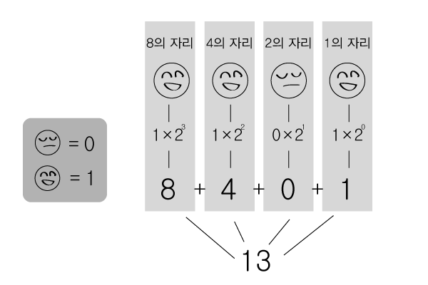

* table of contents
{:toc}

물리적 관점에서 컴퓨터는 전기 신호만을 다룰 수 있다. 전기 신호를 이용해 수를 나타내려면 전압이 낮은 상태를 0에, 전압이 높은 상태를 1에 대응시키기로 약속하면 된다. 이 방법으로 0과 1을 구분하는 논리적 단위를 비트(bit)라고 한다. 비트 하나로는 0과 1밖에 나타내지 못하지만, 비트를 여러 개 묶으면 이진법으로 큰 수도 나타낼 수 있다.(그림 4-1 참고) 비트 하나는 크기가 너무 작아 불편하므로 비트를 8개씩 묶어 사용하는데, 이것을 바이트(byte)라고 한다. 바이트는 하드디스크 같은 저장 매체의 용량을 나타낼 때도 사용되므로 당신에게도 익숙한 표현일 것이다.

**그림 4-1** 비트 묶음으로 수 나타내기

컴퓨터가 처리하는 데이터는 모두 비트 묶음(즉, 수)이다. 글, 음악, 영상 같은 다양한 지식을 컴퓨터로 취급하기 위해서는 부호화(encoding)를 통해 이들을 비트로 표현해야 한다. 부호화 방법은 지식의 종류만큼이나 다양하고, 데이터가 어떻게 부호화되었는지를 알아야 비트를 올바르게 해석할 수 있다. 따라서 데이터는 올바른 문맥으로 취급될 때에만 의미가 있다. 예를 들어, 19860306이라는 값은 문맥이 없을 때는 단지 수일 뿐이지만 생년월일이라는 문맥에서는 사람의 개인정보가 된다.

이를 정리하면 데이터는 값(value)과 유형(type)으로 구성된다고 할 수 있다. 값은 어떤 수의 크기나 어떤 텍스트의 내용이 되는 데이터의 실체(비트 묶음)다. 유형은 데이터를 취급하는 방법(문맥)이다. 데이터는 유형이 무엇인가에 따라 가질 수 있는 값과 적용할 수 있는 연산이 다르다. ``1``과 ``'1'``은 각각 수와 텍스트로 서로 유형이 다르다. 수는 사칙연산이 가능하지만 텍스트는 그렇지 않다. 프로그램을 만들 때는 데이터의 값만이 아니라 유형도 고려해야 한다. 프로그래밍 언어가 제공하는 데이터 유형의 종류와 특징을 잘 알아두는 것은 기본이다.

파이썬은 데이터 유형을 클래스(class)라는 개념을 이용해 제공한다. 클래스가 무엇인지와 직접 클래스를 정의하는 방법은 **8장 클래스와 객체**에서 자세히 배울 것이다. 이 장에서는 파이썬의 기본 데이터 유형을 학습하는 데 초점을 둔다.

> **참고** 부호화라는 개념에 겁먹을 필요 없다
> 
> 부호화는 그냥 데이터를 비트로 표현하는 방법이다. 물론 간단한 작업은 아니지만 이미 권위 있는 국제 기구들이 해놓은 일이다. 오늘날의 응용 프로그래밍에서는 부호화 처리를 프로그래밍 도구(프로그래밍 언어와 라이브러리 등)가 대신한다. 당신이 부호화를 직접 할 일은 거의 없으므로 두려워할 필요가 없다. 전산 전공자가 아니라면 데이터를 부호화하는 방법보다는 데이터 유형별 특징과 사용법을 학습하면 된다.

